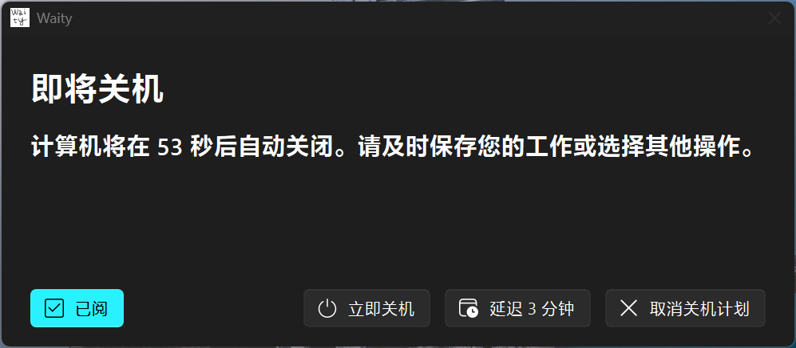

<div align="center">


# Waity

基于 [QFluentWidgets](https://qfluentwidgets.com/) 和 [PySide6](https://doc.qt.io/qtforpython/) 的自动关机提醒工具。

</div>

## 软件截图

<div align="center">



</div>

## 开始使用

### 无 Python 环境

如果您没有 Python 环境或不想手动安装依赖，可以前往 [GitHub Actions](https://github.com/Xwei1645/waity/actions/) 页面下载最新构建的可执行文件。双击 `main.exe` 即可运行。


</details>

### 有 Python 环境

<details>

<summary>展开...</summary>

#### 环境要求

- Python >= 3.10
- Windows

#### 安装依赖

使用 uv 包管理器（推荐）：

```shell
uv sync
```

#### 运行

```shell
uv run main.py
```
</details>

## 进阶操作

### 使用参数启动

Waity 支持通过命令行参数自定义启动行为。您可以组合使用 `--countdown` 和 `--delay` 参数来满足不同需求。

#### 参数说明

| 参数 | 含义 | 默认值 |
|------|------|--------|
| `--countdown` | 倒计时时长（秒） | 60 |
| `--delay` | 延迟选项时长（分钟） | 3 |
| `--show-in-taskbar` | 显示在任务栏中 | 无（不显示） |

> [!IMPORTANT]
> 参数必须为非零自然数。

#### 样例

> [!TIP]
> 以下样例使用可执行文件。使用 Python 解释运行同理。

```shell
.\main.exe --countdown 300  # 5 分钟后自动关机
```

```shell
.\main.exe --delay 10  # 设置延迟选项为 “延迟 10 分钟”
```

```shell
.\run main.exe --countdown 600 --delay 5
```
```shell
.\main.exe --show-in-taskbar  # 显示在任务栏中
```
## 许可证

本项目基于 [GPL v3](https://github.com/Xwei1645/waity?tab=GPL-3.0-1-ov-file) 开放源代码。